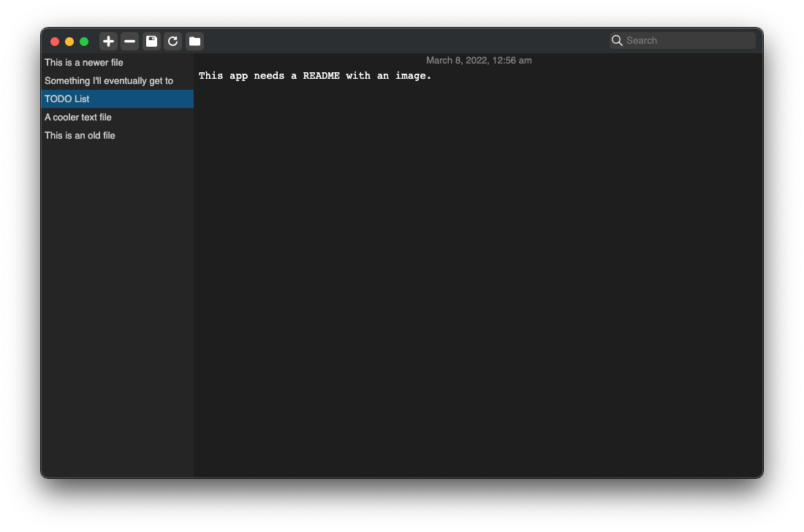

# txt-notes

A simple note taking app that takes cues from Apple notes and popular code editors such as Brackets, VS-Code, and Atom.



## Why?

This app was born out of my desire to combine the "latest notes on top" UX of the Apple notes app with the simplicity of editing local notes files in code editors such as Brackets and Atom.

I specifically wasn't a fan of how Apple notes stores notes files in email form, and code editors are a bit overkill for my purposes, so I took the pieces I liked from both and rolled my own here.

## Download

### macOS

[Download](https://github.com/Autre31415/txt-notes/releases/latest) the `.dmg` file.

### Windows 10+

[Download](https://github.com/Autre31415/txt-notes/releases/latest) the `.exe` file.

## How to run from source

Be sure to have [Node.js](https://nodejs.org) and [git](https://git-scm.com) installed.

Then:

```bash
git clone https://github.com/Autre31415/txt-notes.git
cd txt-notes
npm ci
npm start
```

## Build

Builds are constructed with [electron-builder](https://github.com/electron-userland/electron-builder).

Be sure to have [Node.js](https://nodejs.org) and [git](https://git-scm.com) installed. Linux/Mac users who wish to do builds for Windows will need to have [WINE](https://winehq.org) installed. Mac users who wish to do builds for Windows will need to [XQuartz](https://www.xquartz.org) installed in order to run WINE. It is recommended that Mac users install both Wine and XQuartz via [Homebrew](https://brew.sh).

First, be sure to run:

```bash
git clone https://github.com/Autre31415/txt-notes.git
cd txt-notes
npm ci
```

Then:

To build package zips use:

```bash
npm run pack
```

To build full distributions use:

```bash
npm run dist
```
